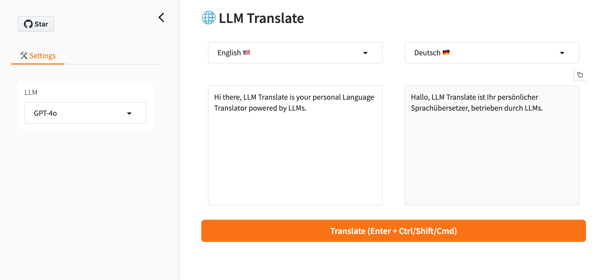

# 🌐 LLM Translate

Your personal Language Translator powered by LLMs.

<p align="center">

</p>


## Installation

```bash
pip install llm-trans
```


## Quick Start

Copy [settings.yaml](./settings.yaml) to your local directory, and run LLM Translate:

```bash
export OPENAI_API_KEY="your-openai-key"
llm-trans ./settings.yaml
```

> You can also add your own LLM by changing the settings as below:
>
> ```yaml
> llms:
> ...
> - title: Your LLM
>   model: your-model
>   api_base: your-api-base
>   api_version: your-api-version
>   api_key: your-api-key # plain key string, or environment variable: ${YOUR_API_KEY}
> ```


## Why?

LLM Translate is like traditional translation tools (e.g. [Google Translate][1]) but is powered by LLMs:

- LLMs are very good at language translation and are still evolving rapidly.
- Any local or online LLMs are supported.


[1]: https://translate.google.com/